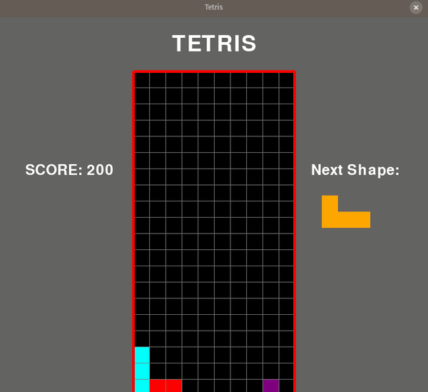

[](https://www.python.org/https://www.python.org/)
[](https://neat-python.readthedocs.io/en/latest/index.html)

# Tetrominoes-NEAT_AI

This project aims at playing the game of Tetris using Genetic Algorithm. This project is developed over the Tetris game version developed by me, refer [here](https://github.com/shashank3199/Tetris). Each line of code is accompanied by a comment to explain it better.<br><br>
The feature of this project that makes it unique of all the other existing similar projects, is it's ability to use the advantage that humans have against computers w.r.t. the game of Tetris, i.e. the ability to view the next piece and take the best possible decision based on that. 

## Game  -



### Files in the Repository - 
The files in the repository are :

#### README.md
The Description file containing details about the repository. The file that you looking at right now.

#### \_\_init__.py
The \_\_init__.py file is to make Python treat directories containing the file as packages.

#### config.txt
The configuration file specifies parameters particular to the genetic NEAT algorithm such as `fitness_threshold, population_size,` etc.

#### requirements.txt
This file contains the respective packages needed to be installed. To install the respective packages, use -

```bash
pip3 install -r requirements.txt

or 

pip install -r requirements.txt
```  
#### test_main.py
This file is used to test the winner model after the training. To test the model  -

 ```bash
python3 test_main.py
```

#### train_main.py
This file is used for training the genetic algorithm.. To train the models -

 ```bash
python3 train_main.py
```

#### utils.py
This file contains utility functions and Parameter class `TetrisParams` for evaluating game metrics.

#### winner.pickle
This file corresponds to the winner genome in my case of training 20 generations, with population size as 100.
I was able to achieve the threshold by the end of second generation. 

#### Tetris -

-   ##### \_\_init__.py
    The \_\_init__.py file is to make Python treat directories containing the file as packages.

-   ##### global_variables.py
    This file contains the global variables that are used in the game such as `SCREEN_WIDTH, SCREEN_HEIGHT,` etc.

-   ##### piece.py
    This file contains the class templates for the various shapes of pieces in the game i.e. `Piece class`.
    
-   ##### shapes.py
    This file contains the shapes of each of the game pieces as lists of lists, it also contains information about the color of each block in RGB format.
    
-   ##### tetris.py
    This file contains the class template for the main game-play i.e. `Tetris class`.

#### .images
This directory contains the images for the game icon and media for the README File.

## Bibliography
- <b>Game Icon:</b> Icons made by [Freepik](https://www.flaticon.com/authors/freepik) from [flaticons.com](https://www.flaticon.com/).
- <b>Game Metrics Reference:</b> [Article](https://towardsdatascience.com/beating-the-world-record-in-tetris-gb-with-genetics-algorithm-6c0b2f5ace9b) by [Duc Anh Bui](https://towardsdatascience.com/@bdanh96)

## Footnote

The Title of this project is inspired by the title of a book owned by my dear friend on the Tetris game. :wink: 

[]( https://github.com/shashank3199 )<br>
[]( https://github.com/BeamingBear )
